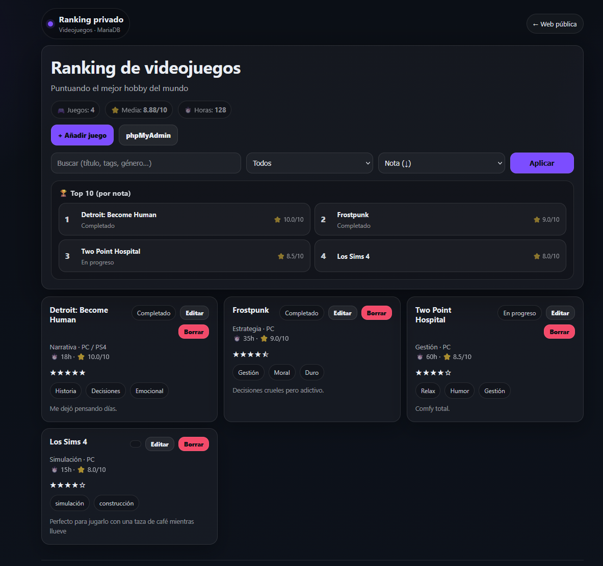
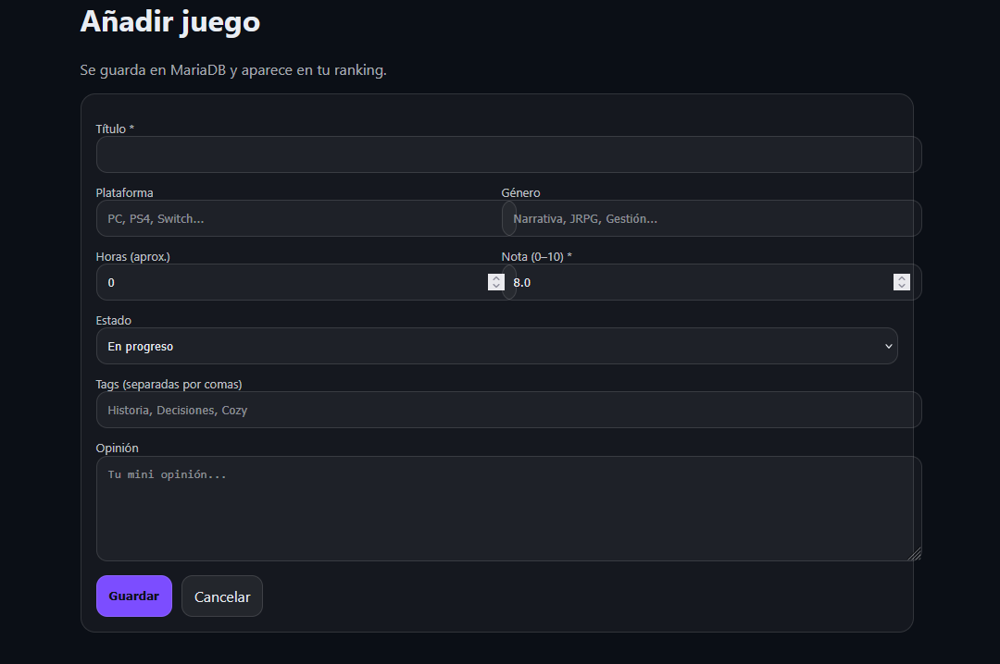

# Game Ranking (PHP + MariaDB) — Virginia Armas

Mini aplicación web para gestionar un **ranking personal de videojuegos**.
Incluye CRUD completo (crear, listar, editar, borrar), **buscador**, **filtros**, **tags** y **Top 10**.

> “Puntuando el mejor hobby del mundo” 🎮

## Demo (local)
- Página: `http://localhost/game-ranking-php/src/`
- phpMyAdmin: `http://localhost/phpmyadmin`

## Tecnologías
- PHP (mysqli)
- MariaDB / MySQL
- Apache (XAMPP)
- HTML + CSS (UI dark minimal)

## Funcionalidades
- ✅ Crear juegos (formulario)
- ✅ Listado con buscador y filtros
- ✅ Editar juegos
- ✅ Borrar juegos
- ✅ Tags (separadas por comas)
- ✅ Top 10 automático por nota

## Instalación (XAMPP)
1. Clona el repo en `C:\xampp\htdocs\` (o copia la carpeta):
   - `C:\xampp\htdocs\game-ranking-php\`

2. Crea la base de datos:
   - Abre `http://localhost/phpmyadmin`
   - Crea la base de datos: `game_rank`

3. Importa la base de datos:
   - Importa `db/schema.sql`
   - (Opcional) Importa `db/seed.sql`

4. Configura la conexión:
   - Copia `src/db.php.example` a `src/db.local.php`
   - Ajusta puerto/credenciales si hace falta

5. Abre la app:
   - `http://localhost/game-ranking-php/src/`

## Screenshots

### Ranking dashboard

### Añadir juego

## Roadmap (mejoras futuras)
- Login (acceso privado)
- Subida de portadas por juego
- Exportación CSV
- Filtro por tag clicable
- Docker (para levantarlo con un comando)

## Autor
**Virginia Armas** — ASIR · Sysadmin junior (Santa Cruz de Tenerife)  
📧 virginiadearmas92@gmail.com  
🐙 GitHub: https://github.com/virginiadearmas
